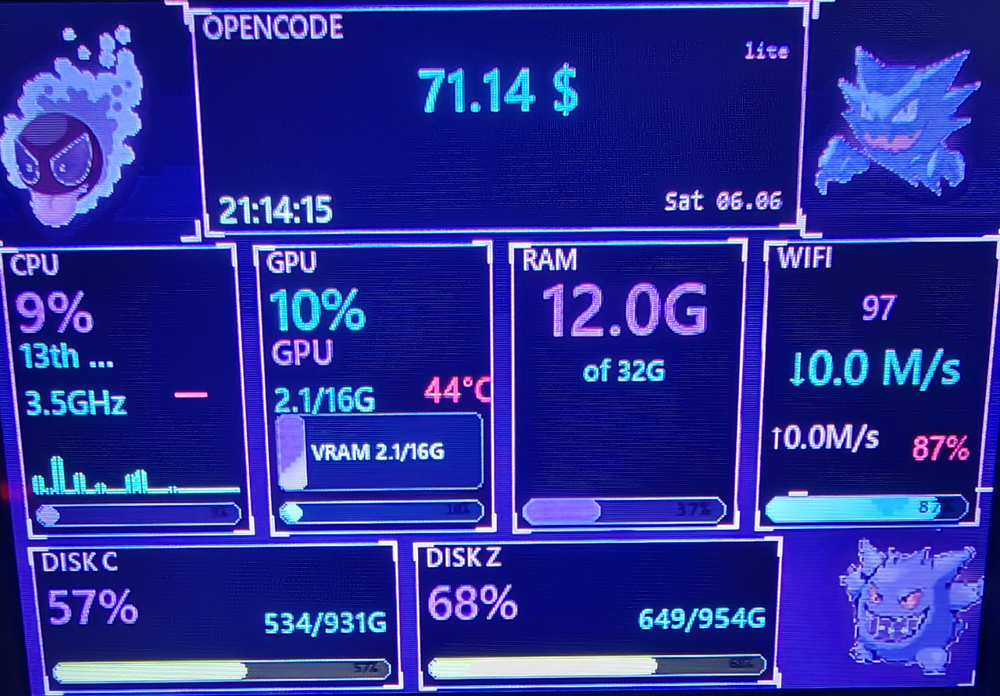
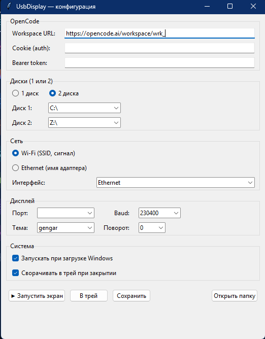

# UsbDisplay

**Наведи на 3.5″ USB Turing Smart Screen — и он покажет всё, что происходит в твоём ПК.**



🟣 Кастомная тема **neon_gengar** с 3 покемонами (Gastly / Haunter / Gengar) в углах, балансом OpenCode, пер-ядровыми барами CPU, VRAM-баром GPU, RAM, сетью и дисками — на маленьком экране, без лагов.

---

## ✨ Что внутри

| Карточка | Описание |
|---|---|
| 🎨 **neon_gengar theme** | 3 анимированных GIF покемонов в углах + неоновый UI с glow, particles и панелями. |
| ⚡ **Partial updates** | На медленном CH340@230400 обновляются только изменившиеся регионы (round-robin GIF + стат-панели). Цикл 3 углов ≈ 2.6 с. |
| 💾 **Мониторинг** | CPU (per-core bars), GPU (VRAM, temp, power), RAM, Wi-Fi/Ethernet (SSID, signal, ↓↑ MB/s), 1–2 диска, hostname, время. |
| 🌐 **OpenCode widget** | Баланс, план (lite/free), использование месяца. Cookie/токен из GUI. Кеш 60 с. |
| 🖼️ **GUI на tkinter** | Все настройки в одном окне: OpenCode, диски, WiFi/Ethernet, COM-порт, baud, тема, поворот, автозапуск, трей. |
| 🗂️ **System tray** | При закрытии сворачивается в трей (pystray). Контекст-меню: «Показать окно» / «Выход». |
| 🚀 **Windows autostart** | Чекбокс в GUI → запись в `HKEY_CURRENT_USER\Software\Microsoft\Windows\CurrentVersion\Run` через `pythonw.exe app.py --autostart`. |
| 🔌 **Авто-recovery** | При зависании дисплея — software reset (cmd=101), затем DTR-пульс, затем долгое ожидание. |
| 📦 **Single .exe** | `UsbDisplay.exe` (PyInstaller) — кладёшь в любую папку, запускаешь. |

---

## 🖥️ Поддерживаемое железо

- **Дисплей**: 3.5″ USB Turing Smart Screen (CH340, ST7796). Протокол Turing 6-byte header.
- **ПК**: Windows 10/11 x64, Python 3.10+ (только для запуска из исходников; .exe — не нужен).

## 📋 Зависимости

```
Pillow
pyserial
numpy
psutil
pynvml         # опционально, для NVIDIA GPU
wmi            # опционально, для CPU/disk temp
pywin32        # опционально, для точной работы с WMI
pystray        # для иконки в трее
```

---

## 🚀 Установка и запуск

### Готовый .exe (рекомендуется)

1. Скачай `UsbDisplay.exe` из [Releases](../../releases).
2. Воткни 3.5″ USB-экран.
3. Запусти `UsbDisplay.exe`.
4. В окне заполни OpenCode (cookie/token), выбери диски и тип сети.
5. Нажми **▶ Запустить экран**.
6. Закрой окно — программа останется в трее.

### Из исходников

```bash
git clone https://github.com/<user>/UsbDisplay.git
cd UsbDisplay
pip install -r requirements.txt
python app.py
```

### Собрать свой .exe

```bash
pip install pyinstaller
pyinstaller --onefile --windowed --name UsbDisplay --add-data "gif;gif" app.py
# результат: dist/UsbDisplay.exe
```

---

## ⚙️ Конфигурация

`config.json` создаётся автоматически при первом сохранении в GUI.

```json
{
  "display": { "port": "AUTO", "baudrate": 230400, "width": 480, "height": 320 },
  "ui":      { "theme": "neon_gengar", "preview_window": true, "framerate": 5 },
  "user":    {
    "opencode_url":     "https://opencode.ai/workspace/wrk_...",
    "opencode_cookie":  "...",
    "opencode_token":   "",
    "disks":            ["C:\\", "Z:\\"],
    "network_type":     "wifi",
    "ethernet_iface":   "",
    "autostart":        false,
    "minimize_to_tray": true
  }
}
```

- **port**: `AUTO` или `COM3`/`COM5`/...
- **baudrate**: `230400` (рекомендуется) или `115200` (фолбэк). `460800`/`921600` — не ставь, дисплей зашумит/зависнет.
- **disks**: 1 или 2 точки монтирования (`C:\\`, `D:\\`, `Z:\\`, ...).
- **network_type**: `wifi` (SSID, signal%) или `ethernet` (имя адаптера, 100%).

---

## 🧩 Архитектура

```
UsbDisplay/
├── app.py              # GUI + tray + display loop в потоке
├── main.py             # CLI-режим (для отладки)
├── gui.py              # tkinter-форма конфигурации
├── tray.py             # pystray иконка + контекст-меню
├── autostart.py        # Windows registry helpers
├── core/
│   ├── config.py       # Display/UI/User config (dataclass + JSON)
│   └── logger.py
├── sensors/
│   └── hardware.py     # psutil/pynvml/wmi + OpenCode-парсер
├── themes/
│   └── neon_gengar.py  # главная тема: GIF + panels + dirty_regions
├── display/
│   ├── serial_lcd.py   # SerialLCD (send_frame, send_region, reset)
│   ├── preview.py      # опциональное preview-окно (для отладки)
│   └── base.py
├── protocol/
│   └── turing.py       # Turing-протокол: pack_cmd, display_bitmap, display_region
├── gif/                # gastly.gif, haunter.gif, gengar.gif
├── opencode_cookie.txt # (опционально) cookie для OpenCode
├── opencode_token.txt  # (опционально) bearer token
├── reset_disp.py       # утилита сброса дисплея (--soft / --dtr / --clear)
├── config.json         # (создаётся автоматически)
├── requirements.txt
├── .gitignore
├── LICENSE
├── README.md
└── index.html          # лендинг для GitHub Pages
```

### Протокол (Turing)

6-байтный заголовок:

```
[x(10) | y(10) | ex(10) | ey(10) | cmd(8)]
```

| Команда | Код | Назначение |
|---|---|---|
| HELLO | 69 | инициализация |
| RESET | 101 | software reset |
| CLEAR | 102 | очистка экрана |
| SET_BRIGHTNESS | 110 | 0..100 |
| SET_ORIENTATION | 121 | 0=PORTRAIT, 2=LANDSCAPE |
| DISPLAY_BITMAP | 197 | отправка картинки (RGB565 LE) |

### Partial updates

- `display_bitmap` (полный кадр) — 307 КБ = 13.4 с @ 230400.
- `display_region` (частичный) — только прямоугольник. 100×100 = 20 КБ = 0.87 с @ 230400.
- Тема возвращает `dirty_regions(snap)` — список изменившихся регионов.
- Round-robin для GIF-углов + все изменившиеся стат-панели за один тик.

---

## 🐛 Известные ограничения

- **Baud 460800+ → шум/виснет дисплей**. Только 115200 / 230400.
- **GIF-анимация ограничена скоростью UART**: 3 угла по 100×100 = ~2.6 с/цикл @ 230400.
- **OpenCode требует авторизацию** (cookie `auth` или Bearer token). Без токена показывает `—.— $`.
- **Превью-окно** (для отладки) замедляет рендер; для боевого режима — `python -u main.py --no-preview`.

## 🛠️ Утилиты

```bash
# Сброс дисплея (3 шага: software → DTR → долгое ожидание)
python reset_disp.py --soft
python reset_disp.py --dtr
python reset_disp.py --clear

# GUI-режим (рекомендуется)
python app.py

# CLI-режим (для отладки)
python main.py --reset --theme neon_gengar --no-preview --rotate 0
```

## 📸 Скриншоты

| Окно настроек | Дисплей |
|---|---|
|  |  |

## 📜 License

MIT — see [LICENSE](LICENSE).

## 🙏 Acknowledgments

- **Pillow** — рендер.
- **pyserial** — COM-порт.
- **psutil / pynvml / wmi** — системные метрики.
- **pystray** — иконка в трее.
- **Pokémon** — Gastly / Haunter / Gengar (c) Nintendo / Game Freak.
- **OpenCode** — workspace API.
