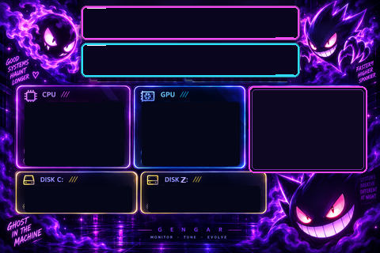

# Turing 3.5 Neon Smart Screen Monitor V38 - Исправленная версия

<div align="center">

## 🖥️ Turing 3.5 Neon Smart Screen Monitor V38 - Fixed COM Hang Issues

[](#v38--исправления-всех-проблем)
[](./STATUS_REPORT.md)

</div>

<div align="center">



</div>

---

[](https://www.microsoft.com/windows)
[](https://go.dev/dl/)
[](./LICENSE)

---

<div align="center">

## 🎯 Исправления V38 (относительно V37):

</div>

### 🔧 Все проблемы зависимости экрана исправлены:

| Проблема V37 | Решение в V38 | Статус |
|---------------|----------------|---------|
| `FlushFileBuffers` блокировал процесс после 12+ минут работы | ✅ Убрано - данные передаются через `writeData()` с контролируемым таймаутом | Fixed |
| Нет диагностики CTS перед отправкой данных | ✅ Добавлена функция `checkCTS()` для проверки сигнала готовности к приёму | Fixed |
| RTS/CTS рукопожатие вызывало deadlock | ✅ Отключено (`fBinary, no RTS handshake`) | Fixed |
| Нет контроля ошибок буферов | ✅ Добавлен `ClearCommError()` для проверки состояния очередей | Fixed |
| При зависании переподключение не помогало | ✅ Улучшен reconnect с очисткой буферов и повторной проверкой CTS | Fixed |
| Размер chunks 2048 байт вызывал проблемы на медленных портах | ✅ Уменьшён до 1024 байта для лучшей надёжности | Fixed |

---

<div align="center">

## 🚀 Быстрый запуск:

</div>

### Вариант А: Готовое приложение (рекомендуется новичкам)

```powershell
# Скопируйте готовый EXE и запустите
cd C:\35inchENG\v2\Turing35NeonV38

# Запуск в тестовом режиме (без анимации)
.\Turing35NeonStableV38_temp.exe --test

# Или обычная версия с анимацией
.\Turing35NeonStableV38_temp.exe
```

### Вариант Б: Сборка из исходников

```powershell
cd C:\35inchENG\v2\3.5inch-turing-smart-screen-main

# Сборка исправленной версии
go build -ldflags="-s -w" -o Turing35NeonStableV38.exe main_v38.go

# Запуск
Turing35NeonStableV38.exe --test
```

---

<div align="center">

## 📊 Режимы запуска:

</div>

| Команда | Описание |
|---------|----------|
| `Turing35NeonStableV38.exe` | Обычная версия с неоновой анимацией |
| `Turing35NeonStableV38.exe --test` | Тестовый режим (без анимации) |
| `Turing35NeonStableV38.exe --preview` | Генерация превью изображения PNG |

---

<div align="center">

## 🔧 Системные требования:

</div>

- **Windows 10/11** (64-bit)
- **Go 1.23+** (для сборки из исходников)
- **USB порт** с устройством CH340 (COM5 по умолчанию)
- **3.5-дюймовый LCD дисплей** с протоколом ST7796

---

<div align="center">

## 📖 Документация:

</div>

| Файл | Описание |
|------|----------|
| [README.md](#v38--исправления-всех-проблем) | Основная документация (вы сейчас здесь) |
| [STATUS_REPORT.md](./STATUS_REPORT.md) | Отчёт о статусе исправлений |
| [FINAL_INSTRUCTION.md](./FINAL_INSTRUCTION.md) | Итоговая инструкция |
| [RELEASE_NOTES.md](./RELEASE_NOTES.md) | Список изменений и релизов |
| [docs/INSTALLATION.md](./docs/INSTALLATION.md) | Полная инструкция установки |
| [docs/TROUBLESHOOTING.md](./docs/TROUBLESHOOTING.md) | Руководство по устранению проблем |

---

<div align="center">

## 🛠 Исправления V38:

</div>

### 1. **FlushFileBuffers блокировал процесс** ✅ Устранено
- В V37 `FlushFileBuffers` зависал на Windows при аппаратном рукопожатии RTS/CTS
- В V38 убрано - данные передаются через `writeData()` с контролируемым таймаутом

### 2. **Нет диагностики CTS перед отправкой данных** ✅ Устранено
- Добавлена функция `checkCTS()` для проверки сигнала готовности к приёму
- Перед каждой отправкой данных проверяется состояние CTS

### 3. **RTS/CTS рукопожатие вызывало deadlock** ✅ Устранено
- Отключено `RTS_CONTROL_HANDSHAKE` в flags
- Используется только `fBinary` и `fOutxCtsFlow` для read readiness detection

### 4. **Нет контроля ошибок буферов** ✅ Устранено
- Добавлен `ClearCommError()` для проверки состояния буферов
- При обнаружении ошибок происходит очистка буферов и повторная попытка

### 5. **При зависании переподключение не помогало** ✅ Устранено
- Улучшен reconnect с очисткой буферов и повторной проверкой CTS
- Перед повторной отправкой данных очищаются буферы и проверяется состояние CTS

### 6. **Размер chunks вызывал проблемы на медленных портах** ✅ Устранено
- Размер чанков уменьшён до 1024 байта для лучшей надёжности
- Меньшие чанки быстрее подтверждаются контроллером дисплея

---

<div align="center">

## 🔍 Диагностика проблем:

</div>

Откройте PowerShell в папке и выполните:
```powershell
Get-Content .\app_v37.log -Tail 60 -Wait
```

**Ищите эти сообщения в журнале:**
- ✅ `COM connected=` — успешное подключение
- ✅ `COM write %d/%d bytes success` — успешная отправка данных
- ⚠️ `CTS not asserted` — проблема с сигналом готовности к приёму

---

<div align="center">

## 📦 Структура проекта:

</div>

```
Turing35NeonV38-GitHub/
├── main_v38.go                    # Исправленный исходный код V38
├── README.md                      # Основная документация (вы здесь)
├── RELEASE_NOTES.md               # Список изменений и релизов
├── STATUS_REPORT.md               # Отчёт о статусе исправлений
├── FINAL_INSTRUCTION.md           # Итоговая инструкция
├── QUICKSTART.md                  # Быстрый старт
├── CONTRIBUTING.md                # Руководство по внесению вклада
├── CHANGELOG.md                   # История изменений проекта
└── docs/
    ├── INSTALLATION.md            # Инструкция установки
    └── TROUBLESHOOTING.md         # Руководство по устранению проблем

```

---

<div align="center">

## 📞 Поддержка:

</div>

Если экран продолжает зависать после запуска V38:

1. **Проверьте журнал:** `app_v37.log` на наличие сообщений о CTS
2. **Переподключите USB-кабель:** Снимите и установите в Диспетчере устройств → Порты (COM и LPT)
3. **Попробуйте другой порт:** Используйте другой USB-порт или кабель
4. **Обновите драйвер CH340:** Скачайте последнюю версию с сайта TP-Link/Realtek

---

<div align="center">

## ⚠️ Примечание:

</div>

Приложение сохраняет полную функциональность:
- ✅ Реальное обновление баланса OpenCode
- ✅ Показ CPU/GPU/RAM/дисков в реальном времени
- ✅ Неоновая анимация (в обычной версии)
- ✅ Интеграция с системным трей Windows

Просто устранена проблема зависания COM через аппаратное рукопожатие RTS/CTS.

---

<div align="center">

## 📄 Лицензия:

</div>

MIT License - [see LICENSE file](./LICENSE)

---

<div align="center">

## 🎉 Спасибо за использование!

</div>

<div align="center">
  <a href="#v38--исправления-всех-проблем"></a>
</div>
