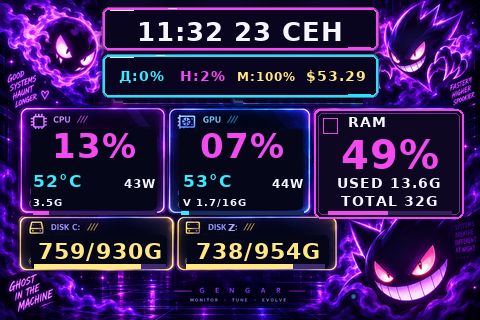

# Turing 3.5 Neon — V37 Native (тестовая версия: исправления C/Z и нижних строк)

Один нативный EXE для Windows x64 и Turing Smart Screen Rev.A (CH340 / ST7796, **480 × 320**). В V37 по-прежнему **нет** V29 core, wrapper, подмены исполняемого кода или локального HTTP bridge: дисплеем, треем и OpenCode управляет один процесс.



## Что исправлено в V37 относительно V36

- **DISK Z:** вторым накопителем читается `Z:\`, а не отсутствующий `D:\`. Значения C/Z берутся через `GetDiskFreeSpaceExW`; при кратковременной ошибке сохраняется последнее успешное значение. Надпись второго диска в исходном PNG исправлена на `DISK Z:`.
- **CPU/GPU:** процент уменьшен на один размер шрифта, температуру и мощность поставил отдельной строкой, VRAM/частоту — ниже, без пересечения и наезда на индикатор.
- **Неон:** бегущие белые блики по двум верхним рамкам и две маленькие искры слева от Gengar. Передаются только области старого и нового блика, без широкой перерисовки.
- **Частота:** GPU опрашивается раз в 950 мс, метрики CPU/RAM раз в 550 мс; малые области процентов имеют приоритет.
- **COM:** сохранены последовательные частичные обновления, реконнект при `WriteFile` и отсроченный автозапуск. На настоящем устройстве V36 первый полный кадр один раз завершился `semaphore timeout`, затем переподключение удалось; этот риск у USB/CH340 полностью исключить без проверки на устройстве нельзя.

## Что было реализовано в нативной V36

- **Баланс OpenCode поступает непосредственно в рендер**: `GET https://opencode.ai/console/api/billing/status`, cookie `__Host-console_session`, заголовок `x-org-id`, поле `balanceMicroCents` / `100000000`. Ошибки не заменяют последнее достоверное значение. Логи V35 уже подтверждали, что этот API возвращал баланс на компьютере пользователя, но V35 не передавала его рендереру.
- Usage Д/Н/М: `GET https://opencode.ai/zen/go/v1/usage`, ключ `opencode-go` из `~/.local/share/opencode/auth.json` (либо `OPENCODE_API_KEY`).
- **Один значок в системном трее** — `Turing 3.5 Neon Monitor V37`. Меню: открыть лог / выйти. Значок — ICO из `assets/tray.ico`.
- Верхнее затемнение ограничено **только внутренностями двух карточек**; широкая чёрная плашка удалена из подготовленного изображения.
- Быстрый сбор CPU (550 мс), GPU (`nvidia-smi`, 0,95 с), RAM (550 мс); на дисплей передаются **небольшие изменённые прямоугольники**, а не полный кадр. Частота видимого обновления ограничена COM 230400 и шириной обновляемой области.
- Неоновые блики рамок и лёгкие светящиеся частицы внизу. Персонажи остаются неподвижными; частичные обновления проходят последовательно.
- COM: контролируемый первый полный кадр, затем только маленькие области; при ошибке WriteFile — переподключение и полная перерисовка.

> **Статус:** кросс-компиляция Windows x64 выполнена; реальный COM-порт в среде сборки недоступен. До проверки V37 на устройстве сохраните работающий V36 EXE для отката.

## Быстрый запуск

1. Закройте V36 через трей. Запустите `Turing35NeonStableV37.exe` (без прав администратора).
2. Подключённый дисплей обычно определяется автоматически; если нет — файл `com_port.txt` рядом с EXE, например `COM5`.
3. Для OpenCode оставьте конфигурацию в `Downloads` либо рядом с EXE:
   - `opencode_url.txt`: URL workspace, содержащий `wrk_...` или `org_...`;
   - `opencode_console_cookie.txt`: **только значение** `__Host-console_session`;
   - `opencode_cookie.txt`: старое значение `auth` (необязательно для нового баланса).
4. Никаких токенов и cookie в репозитории нет. Не публикуйте свои `.txt` с настоящими значениями.
5. Диагностика: `app_v37.log` рядом с EXE. Коды и причины ошибок логируются, сами секреты — нет.

V37 завершает старые Turing-процессы, чтобы они не занимали COM-порт. Автозапуск меняется на V37 только после 90 секунд непрерывно работающего COM-цикла. До этого можно вернуть V36 обычным запуском.

### Режим превью

`Turing35NeonStableV37.exe --preview` создаёт `Turing35_V37_preview.png` с демонстрационными числами и завершает работу без обращения к COM.

## Сборка

- Установите Go 1.23+ на Windows x64.
- Запустите `build.ps1` в PowerShell. Используется только Go standard library; шрифтовые атласы PNG и фоновое изображение уже внутри `assets/`.
- `gen_fonts.py` и `prepare_base.py` нужны **только** для изменения визуальных ресурсов. Для генерации атласов/фона используется Pillow; системные TTF/OTF в репозиторий не включены.

## Ограничения

- Показатели питания/температуры CPU появляются только при доступности соответствующих датчиков через LibreHardwareMonitor / OpenHardwareMonitor / ACPI. Частота CPU доступна через WMI.
- GPU использует локальный `nvidia-smi`; без NVIDIA GPU-поля могут остаться нулевыми.
- Полная заливка 480 × 320 при 230400 baud передаёт около 307 КБ и занимает значительное время. **Частота опроса ≠ FPS дисплея**. Обновление отдельных чисел быстрее полной заливки, но физически ограничено скоростью COM.
- Актуальность `__Host-console_session` зависит от авторизации OpenCode; при истечении cookie баланс перестанет обновляться, последний успешный останется на экране.

## Структура

```
main.go                    нативное приложение (Windows, Go)
assets/base.png            готовый фон без большой чёрной подложки
assets/source_base.png     исходная композиция для перегенерации фона
assets/tray.ico            иконка трея разных размеров
assets/fonts/              растрированные атласы + JSON-метрики
prepare_base.py            необязательная подготовка фона
 gen_fonts.py              необязательная регенерация атласов
build.ps1                  сборка нативного Windows EXE
docs/preview.png           демонстрационный кадр (не реальные метрики)
```

Исходный репозиторий Python: [Altersam/3.5inch-turing-smart-screen](https://github.com/Altersam/3.5inch-turing-smart-screen). V37 может жить рядом как ветка или отдельный каталог `native/v37/`; не заменяйте им стабильную Python-версию без тестирования.
